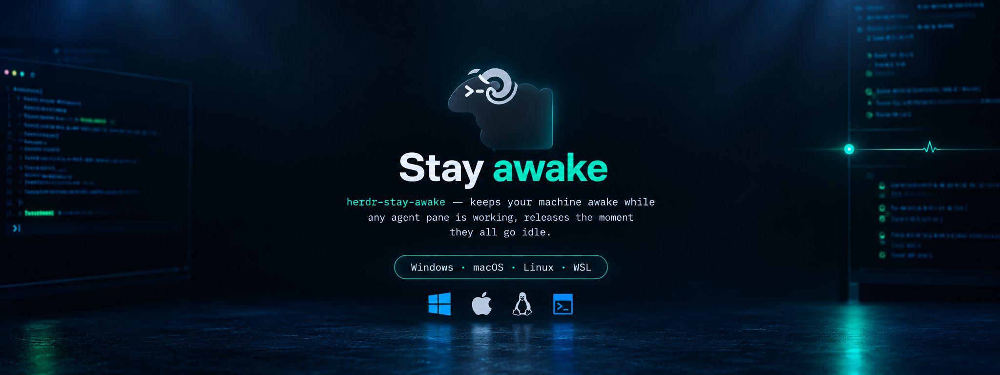

# herdr-stay-awake

<p align="center">
  <a href="README.md">English</a> ·
  <a href="README.ar.md"><strong>العربية</strong></a>
</p>

<p align="center">
  <a href="https://github.com/assawalhy/herdr-stay-awake"></a>
  <a href="https://herdr.dev/docs/plugins/"></a>
  <a href="LICENSE"></a>
  <a href="https://github.com/assawalhy/herdr-stay-awake"></a>
  <a href="https://github.com/assawalhy/herdr-stay-awake"></a>
</p>

<p align="center">
  
</p>

إضافة لـ herdr تُبقي مانع السكون مُفعّلاً طالما أي لوحة وكيل في حالة `working`، وتُحرّره فور عودة جميع اللوحات إلى `idle` أو `done` أو `blocked` أو `unknown`. تدعم macOS و Linux الأصلي و Windows الأصلي و Linux تحت WSL كحالات منفصلة، لأن “إبقاء الجهاز مستيقظاً” يعني شيئاً مختلفاً في كل نظام.

## التثبيت

```bash
herdr plugin install assawalhy/herdr-stay-awake
herdr plugin list
```

لا توجد خطوة بناء — ملف تعريف (manifest) مع ملف `index.js` خفيف كنقطة دخول فوق وحدات `src/`. يستخدم فقط الأدوات المتوفرة في النظام
(`systemd-inhibit`، `caffeinate`، `gdbus`/`dbus-send`، `xdg-screensaver`، `powershell.exe` في WSL/Windows).

### التطوير المحلي

```bash
herdr plugin link /path/to/herdr-stay-awake
herdr plugin list
herdr plugin action list --plugin assawalhy.stay-awake
```

## كيف يحدد “ما زال يعمل”

- عند بدء الإضافة/الخادم، يُشغّل `herdr agent list` مرة واحدة لتهيئة مجموعة اللوحات العاملة من أي وكلاء قيد التشغيل بالفعل (يغطي حالة إعادة تشغيل herdr أثناء مهمة).
- بعد ذلك، يتفاعل مع أحداث `pane.agent_status_changed`: يضيف اللوحة عند `working` ويزيلها عند أي حالة أخرى.
- يُفعّل مانع السكون عندما تنتقل المجموعة من فارغة إلى غير فارغة، ويُعطّله عندما تعود إلى فارغة. جميع الموانع **مرتبطة بالعملية**
  (`caffeinate -w <pid>`، مراقب `systemd-inhibit`، كوكي D-Bus، علامة PowerShell) لذا فإن الانهيار يُحرّر تلقائياً — لا أقفال عالقة.
- على **Linux الأصلي**، يرافق المانع النشط **مراقب حيوية** منفصل: كل 30 ثانية يعيد قراءة `herdr agent list` ويُوفّق الحالة،
  ويحرّر مانع `sleep:idle` فور توقف كل اللوحات. لا يُرسل herdr أحداثاً أثناء المهام الطويلة، لذا لا يجوز أن يعتمد التحرير على
  الأحداث وحدها؛ يخرج المراقب مع المانع ويحدّه `max_hold_seconds`.

فترات السماح (`grace_enabled` في الإعدادات، 5 ثوانٍ للتفعيل / 30 ثانية للإيقاف)
تُقلّل من التذبذب وتغطي فجوات الانهيار؛ **مفعّلة افتراضياً** (بدّلها بـ `t` في لوحة الإعدادات أو عبر `config.json`).

## النوم بعد التحرير (Linux) — `sleep_after_idle_minutes`

سطح المكتب يحاول **مرة واحدة فقط** في كل فترة خمول. إذا كان هناك مانع قائم عند انتهاء المؤقت،
يسجّل GNOME خطأ `BlockedByInhibitorLock` ولا يطلب مرة أخرى — فتبقى الآلة مستيقظة حتى تلمسها،
رغم أن المانع تحرّر قبل ذلك بوقت طويل. مُتحقَّق منه على هذه الآلة: رُفض الطلب 09:10،
تحرّر المانع 12:09، وما زالت مستيقظة 13:06 دون أي مانع.

لذلك لا يخرج المراقب فور التحرير. يبقى نشطاً (`nudge_linger_minutes`، الافتراضي 90 دقيقة)،
وعند خمول الجلسة `sleep_after_idle_minutes` (الافتراضي 30 دقيقة) مع عدم وجود أي لوحة تعمل
لمدتين متصلتين، يعيد هو الطلب عبر `loginctl suspend`. هذا الطلب يمرّ عبر logind،
فلا يزال مرفوضاً طالما وُجد مانع — هو يعيد إيقاظ محاولة سطح المكتب ولا يتجاوز حجزك.

```jsonc
{
  "sleep_after_idle_minutes": 30,      // 0 = بدون إعادة محاولة
  "nudge_linger_minutes": 90,          // كم يبقى المراقب بعد التحرير
  "sleep_while_working_minutes": 0     // اختياري، انظر أدناه
}
```

اضبط `sleep_after_idle_minutes` أكبر من مهلة خمول سطح المكتب (20 دقيقة على الكهرباء /
15 على البطارية في إعدادات GNOME الافتراضية) حتى لا تتسابق مع مؤقّت سطح المكتب.
يعرض `status` مدة الخمول الحالية وهل هي مُجهّزة إعادة المحاولة.

**`sleep_while_working_minutes`** هو الخيار الذي قد لا تريده: `0` (الافتراضي) يُبقي السلوك
الحالي، وأي قيمة موجبة تحرّر المانع **رغم وجود لوحات تعمل** بعد أن تكون خاملاً بهذه المدة —
أي أن النوم يقدّم على تقدّم الوكلاء. وضع S3 يُجمّد الوكلاء ولا يقتلهم، فيستأنفون عند الاستيقاظ.
اضبطه فقط إن كنت تفضّل أن تنام الآلة على تشغيل أسطول كامل أثناء غيابك؛ زر `w` في لوحة
الإعدادات يبدّل بين القيم.

## سلوك المنصات

| المنصة | الآلية | سلسلة البدائل |
| --- | --- | --- |
| macOS | `caffeinate -d -i -s -w <pid>`، يُقتل للتحرير | — |
| Linux (أصلي) | `systemd-inhibit --what=sleep:idle … sleep <max_hold>` + مراقب حيوية كل 30 ثانية يقرأ `herdr agent list` + بقاء بعد التحرير يعيد محاولة النوم المرفوضة من سطح المكتب | → `org.gnome.SessionManager.Inhibit` → `org.freedesktop.ScreenSaver.Inhibit` → `xdg-screensaver` → `xset` → تحذير تدهور |
| Windows (أصلي) | PowerShell مخفي `SetThreadExecutionState` | علامة `herdr-stay-awake-inhibitor-marker` في مسار `-File` |
| WSL | نفس PowerShell عبر التشغيل البيني (`powershell.exe` في `$PATH`، الملف يُكتب في `%TEMP%` الخاص بـ Windows) | — |

يتم اكتشاف Linux غير systemd تلقائياً عبر فحص `hasCommand`
(`gdbus`/`dbus-send`/`qdbus` → GNOME/Freedesktop، وإلا `xdg-screensaver`/`xset`).
يعرض `doctor` أي خلفية تم اختيارها.

## الحالة والفحص الصحي

جميع الإجراءات يتم التحقق منها عبر نظام التشغيل (ليس فقط JSON الخاص بنا):

```bash
herdr plugin action invoke status --plugin assawalhy.stay-awake
herdr plugin action invoke doctor --plugin assawalhy.stay-awake
# مع اختبار إنشاء مؤقت لمدة ثانية
node index.js doctor --probe
```

يعرض `status` (نص + JSON): المنصة، الخلفية، التفعيل (عام + لكل جلسة)، عدد اللوحات العاملة، حالة المانع، تفاصيل `awake` التي تم التحقق منها عبر النظام
(`systemd-inhibit --list`، `pmset -g assertions`، علامة `Get-CimInstance`، D-Bus)، إعدادات فترات السماح، والمشاكل. يضيف `doctor` توفر الأدوات، مسارات الإعدادات، إمكانية الوصول للمقبس، فحص العملية العالقة، آخر حمولة، وعلامة السلامة.

## التفعيل / التعطيل (عام + لكل جلسة)

التعطيل **لا** يستدعي `herdr plugin disable` — تظل الإضافة مسجلة
لذا يمكنك إعادة التفعيل من لوحة الإعدادات. يقتل أي مانع نشط ويعيد النظام إلى حالته المهيأة مسبقاً.

```bash
# عام (يؤثر على جميع الجلسات)
herdr plugin action invoke disable --plugin assawalhy.stay-awake
herdr plugin action invoke enable --plugin assawalhy.stay-awake
herdr plugin action invoke toggle --plugin assawalhy.stay-awake
herdr plugin action invoke open-settings --plugin assawalhy.stay-awake

# لكل جلسة (مرتبط بـ HERDR_SOCKET_PATH hash، ظاهر في status)
node index.js disable --session   # أو --per-session
node index.js enable --session
node index.js disable --global
```

التفعيل الفعّال = `عام && لكل جلسة`. كلاهما يُعاد تحميله عند كل حدث.
الإعدادات في `$(herdr plugin config-dir assawalhy.stay-awake)/config.json`،
تجاوزات كل جلسة في `$(herdr plugin config-dir assawalhy.stay-awake | sed s/config/state/)/session.json`.

## لوحة الإعدادات

نافذة TUI منبثقة مع تبديل عام + لكل جلسة وصحة مُتحقّق منها عبر النظام:

```bash
herdr plugin pane open --plugin assawalhy.stay-awake --entrypoint settings
# أو مباشرة: node index.js settings
# أو عبر الإجراء: herdr plugin action invoke open-settings --plugin assawalhy.stay-awake
```

المفاتيح: `g` تبديل عام، `s` تبديل الجلسة، `t` تبديل فترات السماح، `d` فحص،
`r` تحديث، `q` خروج.

**اختصار لوحة المفاتيح لفتح الإعدادات (أضفه إلى `~/.config/herdr/config.toml`):**

لا يمكن لملفات تعريف الإضافات إعلان اختصارات افتراضية للنوافذ — أضفه إلى إعدادات المستخدم. `prefix+a` → فتح الإعدادات (مُستحسن):

```toml
[[keys.command]]
key = "prefix+a"
type = "plugin_action"
command = "assawalhy.stay-awake.open-settings"
description = "إعدادات Stay Awake"
```

متاح أيضاً: `assawalhy.stay-awake.toggle` لتبديل مباشر بدون واجهة. اضغط `prefix+?` للتحقق.

## الاختبار الذاتي

يتحقق من منطق مشغول/خامل ويُجري اختبار إنشاء مُتحقّق عبر النظام في مجلد حالة مؤقت (لا يمس ملفات pid الحية):

```bash
node index.js selftest
```

## استكشاف الأخطاء

- **التشغيل البيني في WSL:** يجب أن يعمل `powershell.exe` من WSL (`powershell.exe -c "echo hi"`).
  إذا كان محجوباً، فإن فرع Windows متدهور — يبلغ `doctor` عن ذلك.
- **القفل العالق بعد القتل:** الموانع مرتبطة بالعملية؛ `status` يتحقق عبر النظام و
  `reconcile` يعيد تشغيل المقبض الميت تلقائياً. `disable` يعيد النظام دائماً.
- **شكل حمولة الحدث:** لا تنشر وثائق herdr JSON الخاص بـ `pane.agent_status_changed`.
  يجرب `index.js` `pane_id`/`agent_status` مع بدائل؛ تحقق من
  `herdr plugin log list --plugin assawalhy.stay-awake` و
  `cat "$(herdr plugin config-dir assawalhy.stay-awake | sed s/config/state/)/stay-awake.log"`
  بالإضافة إلى `lastPayload` في `doctor` لضبط `extractPaneAndStatus()` إذا لزم الأمر.
- **غير systemd:** يعرض `doctor` أي بديل نشط؛ إذا كان `none`، ثبّت
  `xdg-utils` أو تأكد من تشغيل ناقل جلسة D-Bus.

## الترخيص

MIT — انظر [LICENSE](LICENSE).
