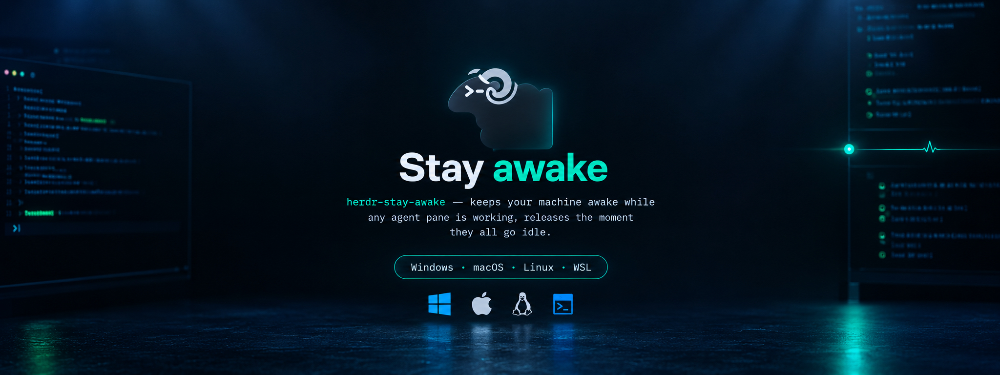

# herdr-stay-awake

<p align="center">
  <a href="README.md"><strong>English</strong></a> ·
  <a href="README.ar.md">العربية</a>
</p>

<p align="center">
  <a href="https://github.com/assawalhy/herdr-stay-awake"></a>
  <a href="https://herdr.dev/docs/plugins/"></a>
  <a href="LICENSE"></a>
  <a href="https://github.com/assawalhy/herdr-stay-awake"></a>
  <a href="https://github.com/assawalhy/herdr-stay-awake"></a>
</p>

<p align="center">
  
</p>

A herdr plugin that holds a sleep inhibitor open for as long as any agent
pane is `working`, and releases it the moment every agent settles back to
`idle`, `done`, `blocked`, or `unknown`. Handles macOS, native Linux,
native Windows, and Linux-under-WSL as four distinct cases, because "keep
the PC awake" means something different on each.

## Install

```bash
herdr plugin install assawalhy/herdr-stay-awake
herdr plugin list
```

No build step — manifest plus one Node script. Uses only system binaries
(`systemd-inhibit`, `caffeinate`, `gdbus`/`dbus-send`, `xdg-screensaver`,
`powershell.exe` on WSL/Windows).

### Local development

```bash
herdr plugin link /path/to/herdr-stay-awake
herdr plugin list
herdr plugin action list --plugin assawalhy.stay-awake
```

## How it decides "still working"

- On plugin/server startup, it runs `herdr agent list` once to seed the
  working-set from whatever's already running (covers herdr restarts mid-task).
- After that, it reacts to `pane.agent_status_changed` events: add on `working`,
  remove on anything else.
- The inhibitor turns on when the working-set goes from empty to non-empty,
  and off when it goes back to empty. Inhibitors are long-lived detached
  processes (`caffeinate -dis`, `systemd-inhibit … sleep N`, Windows PowerShell
  **keeper**) — they do **not** auto-release if the plugin crashes. The safety
  net is `max_hold_seconds` (default 12h): every platform's inhibitor self-exits
  after that, so a stale working-set can't hold the machine awake forever. The
  Windows/WSL keeper re-asserts `SetThreadExecutionState` every 30s and writes a
  heartbeat file so `status` can prove the OS request exists.

Grace periods (`grace_enabled` in config, 5s acquire / 30s release)
debounce flaps and cover crash gaps; **on by default** (toggle with `t` in settings pane or `config.json`).

## Platform behavior

| Platform | Mechanism | Fallback chain |
| --- | --- | --- |
| macOS | detached `caffeinate -d -i -s -t <max_hold>`, killed to release | — |
| Linux (native) | `systemd-inhibit --what=sleep:idle … sleep <max_hold>` | → `org.gnome.SessionManager.Inhibit` → `org.freedesktop.ScreenSaver.Inhibit` → `xdg-screensaver` → `xset` → degraded warning |
| Windows (native) | hidden PowerShell keeper re-asserting `SetThreadExecutionState` every 30s + heartbeat file in state dir | marker `herdr-stay-awake-inhibitor-marker` in `-File` path |
| WSL | same PowerShell keeper via interop (`powershell.exe` on `$PATH`), script + heartbeat in Windows `%TEMP%` for visibility | — |

Non-systemd Linux is auto-detected at runtime via `hasCommand` probing
(`gdbus`/`dbus-send`/`qdbus` → GNOME/Freedesktop, else `xdg-screensaver`/`xset`).
`doctor` shows which backend was chosen.

## Status, doctor & health

All actions are OS-verified (not just our JSON):

```bash
herdr plugin action invoke status --plugin assawalhy.stay-awake
herdr plugin action invoke doctor --plugin assawalhy.stay-awake
# with 1-sec spawn probe (like herdr-awake selftest)
node index.js doctor --probe
# or via herdr: herdr plugin action invoke doctor --plugin assawalhy.stay-awake  # then check log for probe
```

`status` shows (human + JSON): platform, backend, enabled (global + per-session),
working **count** (not per-pane IDs), inhibitor active, OS-verified `awake` detail
(`systemd-inhibit --list`, `pmset -g assertions`, Windows/WSL heartbeat file
freshness + last `SetThreadExecutionState` return value, D-Bus), grace config,
max hold, and issues. `doctor` adds binary presence, config/state paths, keeper
script + heartbeat paths, battery state (Windows/WSL), socket reachable, stale
pid check, last payload, and healthy flag.

> **Windows/WSL verification is heartbeat-based, not process-count based.** A
> PowerShell process sitting in `Start-Sleep` proves nothing (v0.1.0's bug: the
> API call never happened because PowerShell parsed `0x80000001` as a negative
> `Int32` and could not convert it to `UInt32`). `doctor --probe` therefore runs
> an isolated keeper and a previous-flags probe that proves `ES_SYSTEM_REQUIRED`
> is actually registered — no admin needed.

## Enable / disable (global + per-session)

Disabling **does not** call `herdr plugin disable` — the plugin stays registered
so you can re-enable from the settings pane. It kills any active inhibitor and
restores the OS to its preconfigured state.

```bash
# global (affects all sessions)
herdr plugin action invoke disable --plugin assawalhy.stay-awake
herdr plugin action invoke enable --plugin assawalhy.stay-awake
herdr plugin action invoke toggle --plugin assawalhy.stay-awake
herdr plugin action invoke open-settings --plugin assawalhy.stay-awake

# per-session (keyed by HERDR_SOCKET_PATH hash, visible in status)
node index.js disable --session   # or --per-session
node index.js enable --session
node index.js disable --global
```

Effective enabled = `global && session`. Both are hot-reloaded on every event.
Config lives at `$(herdr plugin config-dir assawalhy.stay-awake)/config.json`,
per-session overrides at `$(herdr plugin config-dir assawalhy.stay-awake | sed s/config/state/)/session.json`.

## Settings pane

A popup TUI with global + per-session toggles and live OS-verified health:

```bash
herdr plugin pane open --plugin assawalhy.stay-awake --entrypoint settings
# or directly: node index.js settings
# or via action: herdr plugin action invoke open-settings --plugin assawalhy.stay-awake
```

Keys: `g` toggle global, `s` toggle session, `t` toggle grace, `d` doctor,
`r` refresh, `q` quit.

**Keybind to open settings (add to `~/.config/herdr/config.toml`):**

Herdr plugin manifests can't declare default keybinds for panes — add it to your user config. `prefix+a` → open settings (recommended):

```toml
# open settings popup
[[keys.command]]
key = "prefix+a"
type = "plugin_action"
command = "assawalhy.stay-awake.open-settings"
description = "Stay Awake settings"

# alternative: straight shell binding (no action needed)
# [[keys.command]]
# key = "prefix+a"
# type = "shell"
# command = "herdr plugin pane open --plugin assawalhy.stay-awake --entrypoint settings"
```

Also available: `assawalhy.stay-awake.toggle` for a plain toggle without UI. Press `prefix+?` to verify.

## What this cannot do (Windows/WSL)

`SetThreadExecutionState` (ES_SYSTEM_REQUIRED) prevents **idle** sleep and display
timeout while an agent is working. It cannot prevent:

- **Lid close** and **power/sleep button** (documented by Microsoft: "cannot be
  used to prevent the user from putting the computer to sleep").
- **Battery-critical** forced sleep/hibernate (this plugin cannot stop physics;
  `doctor` reports battery state so you can see it coming).
- **`Hibernate after`** timeouts and screen lock/screensaver.
- Sleep while the WSL VM itself is frozen: during S3 sleep the whole WSL VM is
  suspended — only the Windows-side keeper survives, and its 30s re-assert loop
  re-arms the request after every resume (self-healing).

Manual cross-check (needs admin): `powercfg /requests` should show
`[PROCESS] \Device\HarddiskVolume*\Windows\System32\WindowsPowerShell\v1.0\powershell.exe` with a `System` execution reason while an agent is working.

## Selftest

Validates busy/idle logic and does an OS-verified spawn round-trip in a temp state dir (never touches live pid files). On Windows/WSL it runs isolated keeper + API probes instead of the live round-trip, so a running inhibitor is never disturbed:

```bash
node index.js selftest
```

## Troubleshooting

- **WSL interop:** `powershell.exe` must work from WSL (`powershell.exe -c "echo hi"`).
  If blocked, Windows branch is degraded — `doctor` reports it.
- **Windows/WSL "awake" lie (v0.1.0 bug):** `status` said HEALTHY while the machine
  slept because it counted marker processes, not OS requests. v0.2.0 verifies the
  keeper heartbeat (freshness + `lastRetval`) instead; a machine that already
  slept shows `heartbeat stale` and the next event auto-restarts the keeper.
  `doctor --probe` proves the ES request end-to-end without admin.
- **Machine stays awake after agents finished:** the keeper self-exits after
  `max_hold_seconds` (default 12h). Lower it in
  `$(herdr plugin config-dir assawalhy.stay-awake)/config.json`
  (`"max_hold_seconds": 3600`) or run `disable`/`status` to release early.
- **Orphan inhibitor after plugin crash:** inhibitors are long-lived detached
  processes; if the plugin dies, each one still self-exits at `max_hold_seconds`
  (default 12h). `status` OS-verifies and `reconcile` auto-restarts a dead
  handle; `disable` always restores OS immediately.
- **Event payload shape:** herdr docs don't publish `pane.agent_status_changed` JSON.
  `index.js` tries `pane_id`/`agent_status` with fallbacks; check
  `herdr plugin log list --plugin assawalhy.stay-awake` and
  `cat "$(herdr plugin config-dir assawalhy.stay-awake | sed s/config/state/)/stay-awake.log"`
  plus `doctor`'s `lastPayload` to adjust `extractPaneAndStatus()` if needed.
- **Non-systemd:** `doctor` shows which fallback is active; if `none`, install
  `xdg-utils` or ensure a D-Bus session bus is running.

## License

MIT — see [LICENSE](LICENSE).
